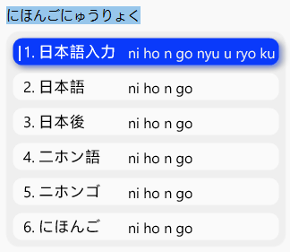
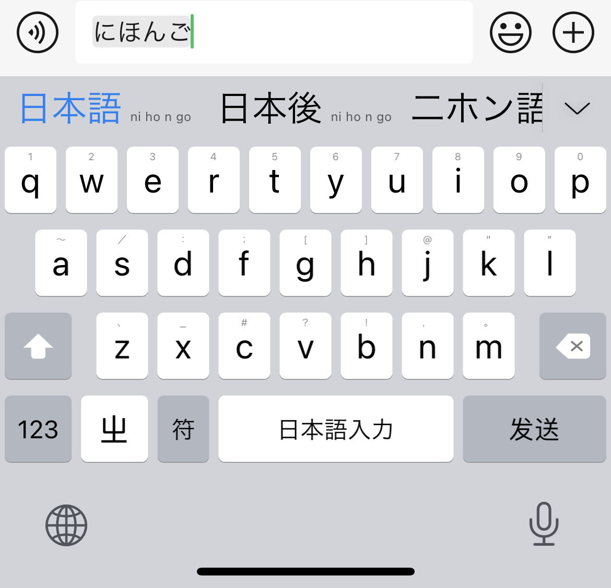
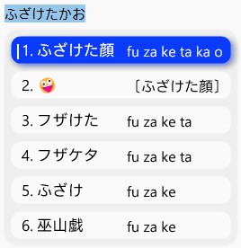
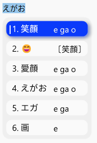
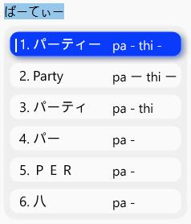
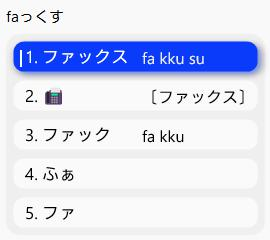
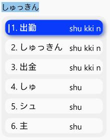

# About
Rime Japanese Input Method Solution。一个使用Rime的日本語入力


方案参考借鉴这个项目https://github.com/gkovacs/rime-japanese


词典使用到谷歌mozc开源的日语输入法


效果：



iOS上iRime使用效果：



添加了Emoji🥳表情：




## 平假名

### 清音

按照罗马拼音正常输入，对照五十音图。

```
あ い う え お /ア イ ウ エ オ a i u e o
か き く け こ /カ キ ク ケ コ ka ki ku ke ko
さ し す せ そ /サ シ ス セ ソ sa shi su se so
た ち つ て と /タ チ ツ テ ト ta chi tsu te to
な に ぬ ね の /ナ ニ ヌ ネ ノ na ni nu ne no
は ひ ふ へ ほ /ハ ヒ フ ヘ ホ ha hi fu he ho
ま み む め も /マ ミ ム メ モ ma mi mu me mo
や ゆ よ /ヤ ユ ヨ ya yu yo
ら り る れ ろ /ラ リ ル レ ロ ra ri ru re ro
わ を /ワ ヲ wa wo
ん /ン n
```

需要注意的是其中有几个

- し 是 `shi` 而不是 si
- ち 是 `chi`
- つ 是 `tsu`

### 浊音

```
が　ぎ　ぐ　げ　ご \ ガ　ギ　グ　ゲ　ゴ ga gi gu ge go
ざ　じ　ず　ぜ　ぞ \ ザ　ジ　ズ　ゼ　ゾ za ji zu ze zo
だ　ぢ　づ　で　ど \ ダ　ヂ　ヅ　デ　ド da di du de do
ば　び　ぶ　べ　ぼ \ バ　ビ　ブ　べ　ボ ba bi bu be bo
```

### 半浊音

```
ぱ　ぴ　ぷ　ぺ　ぽ \ パ　ピ　プ　ぺ　ポ pa pi pu pe po
```

### 拗音

拗音的输入则是要记住 `y` 的位置。

```
きゃ　きゅ　きょ  \ キャ　キュ　キョ kya kyu kyo
しゃ　しゅ　しょ \ シャ　シュ　ショ sha shu sho
ちゃ　ちゅ　ちょ \ チャ　チュ　チョ cha chu cho
にゃ　にゅ　にょ \ ニャ　ニュ　ニョ nya nyu nyo
ひゃ　ひゅ　ひょ \ ヒャ　ヒュ　ヒョ hya hyu hyo
みゃ　みゅ　みょ \ ミャ　ミュ　ミョ mya myu myo
りゃ　りゅ　りょ \ リャ　リュ　リョ rya ryu ryo
ぎゃ　ぎゅ　ぎょ \ ギャ　ギュ　ギョ gya gyu gyo
じゃ　じゅ　じょ ジャ　ジュ　ジョ ja ju jo
びゃ　びゅ　びょ ビャ　ビュ　ビョ bya byu byo
ぴゃ　ぴゅ　ぴょ ピャ　ピュ　ピョ pya pyu pyo
```

### Emoji表情开关

这个方案使用的F6 切换Emoji表情。

### 平假名的`ー`

用 `q` 输入

### 拨音输入

拨音输入 n，比如

- にほん　nihon

### 促音输入

っ(促音)双打后一个假名的罗马字发音的第一个辅音，如“ちょっと”为“chotto”。输入两次 `t`

### 小写

小写的输入，在前面加上 `x` 或 `l` 即可

输入字母 `l` 或 `x`+a、i、u、e、o，输入 `la` 得到ぁ，输入 `xa` 也得到ぁ，输入 `li` 得到ぃ。

或者在 Rime 的日文方案里面，比如日语的派对（party）

```
パーティー
```

可以直接输入 `pa-thi-`



### 两个连续的小写

在一些日语单词中会出现连续的两个小写字母，比如

ファックス  传真



这个时候输入的时候 `fakkusu`。 促音的输入是和后面的音多输入一次 `k`。

- `しゅっきん` 出勤，输入 `shukkin`



### 古语

古语假名ゐ和ゑ的输入

ゐ输入 wi 

ゑ输入 we
